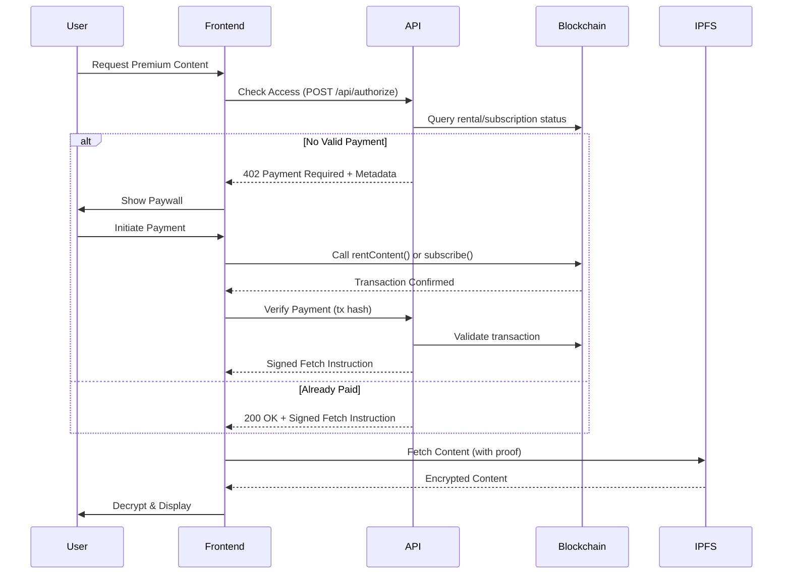

<div align="center">

# 🎥 ContentHub

### **A Decentralized Premium Content Marketplace Powered by x402**

*Stream. Read. Own.*

[](https://contenthub-x402.vercel.app)
[](https://contenthub-x402.vercel.app)
[](https://github.com/SpiderNitt/contenthub)
[](https://github.com/SpiderNitt/contenthub)

[🌐 Live Demo](https://contenthub-x402.vercel.app) • [📖 Documentation](#-documentation) • [🚀 Quick Start](#-quick-start) • [💳 x402 Protocol](#-x402-payment-protocol)

</div>

---

## 🌟 **Overview**

**ContentHub** is a next-generation decentralized content marketplace built on **Base Sepolia** that revolutionizes content monetization using the **x402 Payment Protocol**. This innovative approach combines HTTP 402 status codes with blockchain-based payments to create seamless "pay-to-access" functionality.

Creators monetize premium content (videos, articles, podcasts, newsletters) directly through smart contracts while maintaining 100% ownership. Users enjoy flexible access options—**Rent (24h)** or **Buy (Lifetime)**—with payments in **ETH** or **USDC**.

Content is stored on **IPFS** via Lighthouse/Walrus, and cryptographic proofs ensure secure, censorship-resistant content delivery.

---

## 💳 **x402 Payment Protocol**

### **What is x402?**

The **x402 Payment Protocol** is ContentHub's core innovation—a standardized HTTP-based payment mechanism that bridges Web2 UX with Web3 payment rails:

```
┌─────────────────────────────────────────────────────────────┐
│  Traditional Web Request → HTTP 402 Response → Blockchain   │
│  Payment → Cryptographic Proof → Content Access            │
└─────────────────────────────────────────────────────────────┘
```

### **How It Works**

1. **User Requests Content** → Frontend checks access rights
2. **Backend Returns 402** → "Payment Required" with blockchain payment metadata
3. **Smart Contract Payment** → User pays via ETH/USDC on Base Sepolia
4. **Transaction Verification** → Backend verifies on-chain payment
5. **Cryptographic Proof** → Server issues signed access token
6. **Content Delivery** → IPFS content unlocked with valid proof

### **Protocol Flow Diagram**



### **Key Components**

| Component | Technology | Purpose |
|-----------|-----------|---------|
| **HTTP 402 Status** | Standard HTTP | Signal payment requirement |
| **Payment Metadata** | JSON | Provide blockchain tx details |
| **Smart Contract** | Solidity | Execute & record payments |
| **Cryptographic Proof** | HMAC-SHA256 | Authorize content access |
| **IPFS Storage** | Lighthouse | Store encrypted content |

### **Payment Metadata Structure**

```typescript
{
  "chainId": 84532,                    // Base Sepolia
  "tokenAddress": "0x0000...0000",     // ETH or USDC
  "amount": "1000000000000000",        // 0.001 ETH in wei
  "recipient": "0xCreator...",         // Creator's wallet
  "paymentParameter": {
    "minerOf": "42"                    // Content ID
  }
}
```

### **Cryptographic Proof Example**

```typescript
{
  "blobId": "bafybei...",              // IPFS CID
  "userWallet": "0xUser...",           // User's address
  "issuedAt": 1706457600,              // Unix timestamp
  "expiry": 1706544000,                // 24 hours later
  "nonce": "uuid-v4",                  // Unique ID
  "signature": "a8c7f3..."             // HMAC signature
}
```

### **Benefits**

✅ **Instant Payments** – No waiting for off-chain confirmations  
✅ **Transparent Pricing** – All costs visible before payment  
✅ **Creator Direct** – 100% revenue, no platform fees  
✅ **Offline Access** – Proofs enable local content caching  
✅ **Token Flexibility** – Pay with ETH or stablecoins (USDC)  
✅ **Time-Bound Access** – Smart contracts enforce rental periods  
✅ **Censorship Resistant** – Decentralized storage + on-chain verification  

---

## 🏗️ **Project Architecture**

```
contenthub/
├── contracts/           # Foundry Smart Contracts (77.7% Solidity)
│   ├── src/            # Solidity source files
│   │   ├── CreatorHub.sol      # Main marketplace contract
│   │   │   ├── rentContent()   # 24-hour rental logic
│   │   │   ├── subscribe()     # Monthly subscription logic
│   │   │   └── checkRental()   # Access verification
│   │   └── Counter.sol         # Example contract
│   ├── test/           # Contract tests
│   ├── script/         # Deployment scripts
│   └── foundry.toml    # Foundry configuration
│
└── frontend/           # Next.js 15 Application (20.7% TypeScript)
    ├── src/
    │   ├── app/
    │   │   ├── api/
    │   │   │   ├── authorize/  # x402 endpoint (POST /api/authorize)
    │   │   │   └── content/    # Content delivery with proof validation
    │   │   ├── content/[id]/   # Dynamic content pages
    │   │   └── library/        # User's purchased/rented content
    │   ├── components/
    │   │   ├── Paywall.tsx     # x402 payment UI
    │   │   └── VideoPlayer.tsx # Protected content player
    │   ├── hooks/
    │   │   └── useX402.ts      # Payment state management
    │   ├── lib/
    │   │   └── auth.ts         # Privy authentication + proof signing
    │   ├── types/
    │   │   ├── x402.ts         # Payment protocol types
    │   │   └── api.ts          # API response types
    │   └── config/
    │       └── env.ts          # Environment configuration
    ├── public/         # Static assets
    └── next.config.ts  # Next.js configuration
```

---

## ✨ **Key Features**

### 🎯 **For Content Consumers**

- **🔐 Wallet Authentication**: Secure login via Privy (supports MetaMask, WalletConnect, and more)
- **💰 x402-Powered Payments**: Seamless crypto payments with ETH or USDC on Base Sepolia
- **⏰ Flexible Access Models**:
  - **Rent**: 24-hour access to premium content
  - **Buy**: Lifetime access with on-chain ownership proof
- **📚 My Library**: Personal dashboard to manage rentals and purchases with expiry indicators
- **🎨 Premium UI/UX**: Glassmorphism design with smooth animations powered by Framer Motion
- **🔍 Content Discovery**: Browse curated content from verified creators
- **📱 Responsive Design**: Optimized for desktop, tablet, and mobile
- **⚡ Instant Access**: Content unlocks immediately after payment confirmation

### 🎬 **For Content Creators**

- **💸 Direct Monetization**: 100% revenue goes directly to your wallet (no middlemen)
- **🔗 On-Chain Ownership**: Content catalog is permanently registered on the blockchain
- **📦 Decentralized Storage**: Content stored on IPFS via Lighthouse/Walrus
- **🎛️ Creator Dashboard**: Manage your content, pricing, and subscriptions
- **📊 Transparent Analytics**: Track earnings, subscribers, and content performance
- **🛡️ Content Protection**: x402 protocol ensures access control with cryptographic proofs
- **💳 Multi-Token Support**: Accept payments in ETH or USDC
- **📈 Subscription Management**: Set custom monthly subscription prices
- **🔄 Automated Renewals**: Smart contracts handle subscription extensions

---

## 🛠️ **Tech Stack**

| Layer | Technology | Description |
|-------|-----------|-------------|
| **Payment Protocol** | **x402** | HTTP 402 + blockchain payment verification |
| **Frontend** | Next.js 15 | React framework with App Router |
| **Styling** | Tailwind CSS v4 | Utility-first CSS framework |
| **Animation** | Framer Motion | Production-ready animation library |
| **Smart Contracts** | Foundry | Fast, portable Ethereum development toolkit |
| **Blockchain** | Solidity ^0.8.30 | Smart contract programming language |
| **Authentication** | Privy | Wallet authentication and user management |
| **Storage** | Lighthouse (IPFS) | Decentralized content storage |
| **Network** | Base Sepolia | Ethereum L2 testnet |
| **Payment Tokens** | ETH & USDC | Native and stablecoin payments |
| **Type Safety** | TypeScript | Strongly typed JavaScript |
| **Database** | Prisma | Type-safe database ORM |
| **Cryptography** | HMAC-SHA256 | Content access proof signing |

---

## 🚀 **Quick Start**

### **Prerequisites**

- **Node.js** 18+ ([Download](https://nodejs.org/))
- **Foundry** ([Install](https://getfoundry.sh/))
- **Web3 Wallet** with Base Sepolia ETH ([Faucet](https://www.alchemy.com/faucets/base-sepolia))

---

### **1️⃣ Clone the Repository**

```bash
git clone https://github.com/SpiderNitt/contenthub.git
cd contenthub
```

---

### **2️⃣ Smart Contracts Setup**

```bash
cd contracts

# Install dependencies
forge install

# Build contracts
forge build

# Run tests
forge test

# Deploy to Base Sepolia (requires .env setup)
forge script script/Deploy.s.sol:DeployScript --rpc-url baseSepolia --broadcast --verify
```

**Environment Variables** (`contracts/.env`):

```bash
BASE_SEPOLIA_RPC_URL=https://sepolia.base.org
PRIVATE_KEY=your_deployer_private_key
ETHERSCAN_API_KEY=your_etherscan_api_key
```

---

### **3️⃣ Frontend Setup**

```bash
cd frontend

# Install dependencies
npm install

# Run development server
npm run dev
```

**Environment Variables** (`frontend/.env.local`):

```bash
# Privy Authentication
NEXT_PUBLIC_PRIVY_APP_ID=your_privy_app_id
PRIVY_APP_SECRET=your_privy_app_secret

# Content Signing (for x402 proofs)
CONTENT_SIGNING_SECRET=your_signing_secret_min_32_chars

# Database
DATABASE_URL=your_database_url

# API Configuration
NEXT_PUBLIC_API_BASE_URL=http://localhost:3000
ALLOWED_ORIGINS=http://localhost:3000

# Blockchain
NEXT_PUBLIC_RPC_URL=https://sepolia.base.org

# Feature Flags
NEXT_PUBLIC_ENABLE_ANALYTICS=false
ENABLE_DEBUG_LOGS=true
```

**Access the App**: Open [http://localhost:3000](http://localhost:3000)

---

## ⛓️ **Deployed Contracts**

| Contract | Address (Base Sepolia) | Explorer |
|----------|------------------------|----------|
| **CreatorHub** | `0xc567c6112720d8190caa4e93086cd36e2ae01d37` | [View](https://sepolia.basescan.org/address/0xc567c6112720d8190caa4e93086cd36e2ae01d37) |
| **USDC (Testnet)** | `0x036CbD53842c5426634e7929541eC2318f3dCF7e` | [View](https://sepolia.basescan.org/address/0x036CbD53842c5426634e7929541eC2318f3dCF7e) |

---

## 🏛️ **Smart Contract Overview**

The **CreatorHub** contract (`contracts/src/CreatorHub.sol`) implements x402 payment logic:

### **Core Functionality**

```solidity
// 24-hour rental payment
function rentContent(uint256 _contentId) external payable {
    Content memory content = contents[_contentId];
    require(content.active, "Content not active");
    require(msg.value >= content.rentedPrice, "Insufficient payment");
    
    // Record rental with 24-hour expiry
    rentals[msg.sender][_contentId] = block.timestamp + 24 hours;
    
    // Transfer payment to creator (100% revenue)
    (bool sent, ) = payable(content.creatorAddress).call{value: msg.value}("");
    require(sent, "Payment failed");
    
    emit ContentRented(msg.sender, _contentId, block.timestamp + 24 hours);
}

// Monthly subscription payment
function subscribe(address _creator) external payable {
    require(cret[_creator].isRegistered, "Creator not registered");
    require(msg.value >= cret[_creator].subscriptionPrice, "Insufficient payment");
    
    uint256 currentExpiry = subscriptions[msg.sender][_creator];
    uint256 newExpiry = currentExpiry > block.timestamp
        ? currentExpiry + 30 days
        : block.timestamp + 30 days;
    
    subscriptions[msg.sender][_creator] = newExpiry;
    
    (bool sent, ) = payable(_creator).call{value: msg.value}("");
    require(sent, "Payment failed");
    
    emit Subscribed(msg.sender, _creator, newExpiry);
}

// Access verification for x402
function checkRental(address _user, uint256 _contentId) 
    external 
    view 
    returns (bool) 
{
    return rentals[_user][_contentId] > block.timestamp;
}
```

### **Key Data Structures**

```solidity
struct Content {
    uint256 id;
    address creatorAddress;
    ContentType cType;           // VIDEO, ARTICLE, PODCAST, etc.
    string metadataURI;          // IPFS metadata
    bool isFree;
    uint256 fullPrice;           // Lifetime access price
    uint256 rentedPrice;         // 24-hour rental price
    address paymentToken;        // ETH or USDC
    bool active;
}

struct Creator {
    string name;
    address wallet;
    bool isRegistered;
    uint256 subscriptionPrice;   // Monthly subscription in wei
    uint256 subscriberCount;
    uint256 totalEarnings;
}

// Mappings
mapping(address => mapping(uint256 => uint256)) public rentals;       // user => contentId => expiry
mapping(address => mapping(address => uint256)) public subscriptions; // user => creator => expiry
```

---

## 🔄 **x402 Payment Flow (Step-by-Step)**

### **Example: Renting a Video**

```typescript
// 1. User clicks "Rent for 24h" button
async function handleRent() {
  // 2. Frontend checks access via API
  const response = await fetch('/api/authorize', {
    method: 'POST',
    headers: { 'Authorization': `Bearer ${privyToken}` },
    body: JSON.stringify({ 
      contentId: 42,
      creatorAddress: '0xCreator123...'
    })
  });
  
  // 3. Backend returns 402 Payment Required
  if (response.status === 402) {
    const { paymentMetadata } = await response.json();
    
    // 4. Show paywall with payment details
    setShowPaywall(true);
    setPaymentMetadata(paymentMetadata);
    
    // 5. User confirms payment
    const { initiateRentalPayment } = useX402();
    await initiateRentalPayment(
      42,                          // contentId
      '0xCreator123...',          // creator
      '1000000000000000',         // 0.001 ETH
      '0x0000000000000000'        // ETH address
    );
    
    // 6. Smart contract transaction submitted
    // 7. Wait for blockchain confirmation
    // 8. Backend verifies transaction
    // 9. Receive cryptographic proof (fetchInstruction)
    // 10. Fetch content from IPFS with proof
    // 11. Display video to user
  }
  
  // If status === 200, access already granted
  if (response.ok) {
    const { fetchInstruction } = await response.json();
    fetchProtectedContent(fetchInstruction);
  }
}
```

---

## 🧪 **Development Workflow**

### **Running Tests**

```bash
# Contract tests
cd contracts && forge test -vv

# Frontend tests (if configured)
cd frontend && npm test
```

### **Code Formatting**

```bash
# Solidity
cd contracts && forge fmt

# TypeScript/JavaScript
cd frontend && npm run lint
```

### **Local Blockchain**

```bash
# Start local Anvil node
anvil

# Deploy contracts locally
forge script script/Deploy.s.sol --rpc-url http://localhost:8545 --broadcast
```

---

## 📂 **Repository Branches**

| Branch | Status | Description |
|--------|--------|-------------|
| **main** | ✅ Stable | Production-ready code |
| **dev** | 🚧 Active | Latest features under development |

**Recent Commits (x402-related):**
- `0dbf925` - Client-side subscription proof-of-payment using local storage and `useX402`
- `f11e616` - Subscription functionality with ERC20 token integration
- `bec6d88` - On-chain rentals, library, and persistence fixes with x402 verification
- `df033fd` - Payment flow bug fixes (rental tracking & price unit mismatch)

---

## 🤝 **Contributing**

We welcome contributions! Here's how you can help:

1. **Fork** the repository
2. **Create** a feature branch (`git checkout -b feature/AmazingFeature`)
3. **Commit** your changes (`git commit -m 'Add some AmazingFeature'`)
4. **Push** to the branch (`git push origin feature/AmazingFeature`)
5. **Open** a Pull Request

---

## 📖 **Documentation**

### **External Resources**
- [Foundry Book](https://book.getfoundry.sh/) - Smart contract development
- [Next.js Docs](https://nextjs.org/docs) - Frontend framework
- [Privy Docs](https://docs.privy.io/) - Authentication
- [Base Docs](https://docs.base.org/) - L2 network
- [IPFS Docs](https://docs.ipfs.tech/) - Content storage

---

## 🔗 **Links**

- **Live App**: [https://contenthub-x402.vercel.app](https://contenthub-x402.vercel.app)
- **GitHub**: [https://github.com/SpiderNitt/contenthub](https://github.com/SpiderNitt/contenthub)
- **Organization**: [SpiderNitt](https://github.com/SpiderNitt)

---


## 📊 **Repository Stats**

- **Created**: January 2026 (23 days ago)
- **Languages**: Solidity (77.7%), TypeScript (20.7%), Python (1.5%)
- **Size**: 7.5 MB
- **Branches**: 2 (main, dev)
- **Commits**: 15+
- **Homepage**: https://contenthub-x402.vercel.app

---

## 🎯 **Use Cases**

| Content Type | Use Case | Payment Model |
|--------------|----------|---------------|
| **🎥 Videos** | Educational courses, tutorials, entertainment | Rent (24h) or Buy (lifetime) |
| **📰 Articles** | Premium journalism, research papers | Rent (24h) or Subscribe (monthly) |
| **🎙️ Podcasts** | Exclusive episodes, behind-the-scenes | Subscribe (monthly) |
| **🎵 Audio** | Music albums, audiobooks | Buy (lifetime) |
| **📧 Newsletters** | Premium insights, market analysis | Subscribe (monthly) |

---

## 🛡️ **Security Features**

- ✅ **Smart Contract Auditing**: Follow Foundry best practices
- ✅ **Cryptographic Proofs**: HMAC-SHA256 signatures for content access
- ✅ **Time-Bound Access**: On-chain expiry verification
- ✅ **Wallet Authentication**: Privy-powered secure login
- ✅ **Decentralized Storage**: IPFS ensures content persistence
- ✅ **No Custody**: Users maintain full control of their wallets

---

## 📄 **License**

This project is licensed under the **MIT License** - see the [LICENSE](LICENSE) file for details.

---

## 🙏 **Acknowledgments**

- **Base** for the scalable L2 infrastructure
- **Privy** for seamless wallet authentication
- **Lighthouse** for decentralized storage
- **Foundry** for the blazing-fast development toolkit
- **Vercel** for deployment and hosting
- The **x402 Protocol** community for pioneering payment-required web standards

---

<div align="center">

**Built with ❤️ by Spider R&D**

⭐ **Star this repo if you find it useful!** ⭐

*Revolutionizing content monetization, one payment at a time.*

</div>
